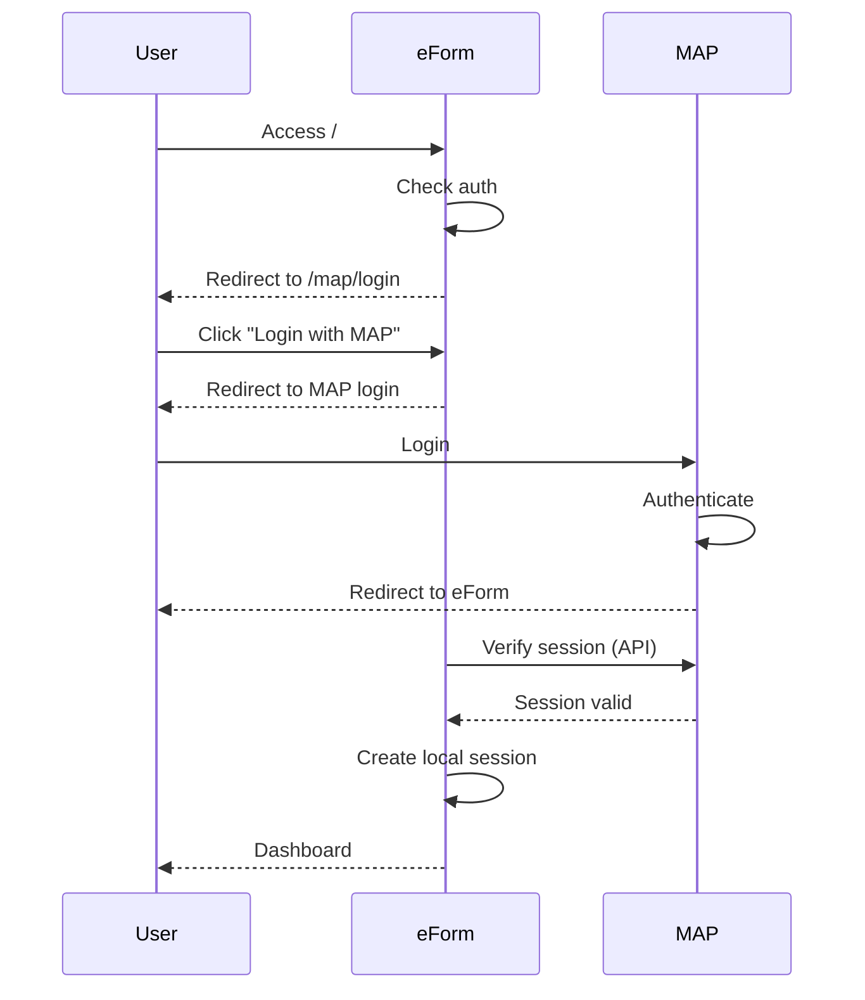

# MAP-eForm SSO Production Deployment Guide

## Overview

This guide documents deploying eForm with SSO integration to MAP (Muamalat Application Platform).

| Component | Technology | Port |
|-----------|-----------|------|
| MAP | Django/Python | 8000 (production: 80/443) |
| eForm | Laravel 12 / PHP 8.2 | 9001 (nginx) / 9000 (PHP-FPM) |

---

## 1. eForm Docker Setup

### 1.1 Dockerfile

```dockerfile
FROM php:8.2-fpm

# Install dependencies
RUN apt-get update && apt-get install -y \
    git curl libpng-dev libonig-dev libxml2-dev \
    zip unzip sqlite3 libsqlite3-dev

RUN apt-get clean && rm -rf /var/lib/apt/lists/*

# Install PHP extensions
RUN docker-php-ext-install pdo pdo_sqlite mbstring exif pcntl bcmath gd

# Get Composer
COPY --from=composer:latest /usr/bin/composer /usr/bin/composer

WORKDIR /var/www/html
COPY --chown=www-data:www-data . /var/www/html

RUN composer install --no-dev --optimize-autoloader

# Create storage directories
RUN mkdir -p /var/www/html/storage/framework/{cache,sessions,views} \
    && mkdir -p /var/www/html/storage/logs \
    && mkdir -p /var/www/html/bootstrap/cache

# Set permissions
RUN chown -R www-data:www-data /var/www/html/storage \
    && chown -R www-data:www-data /var/www/html/bootstrap/cache \
    && chmod -R 775 /var/www/html/storage \
    && chmod -R 775 /var/www/html/bootstrap/cache

EXPOSE 9000
CMD ["php-fpm"]
```

### 1.2 docker-compose.yml

```yaml
services:
  web:
    container_name: eform_web
    build:
      context: .
      dockerfile: Dockerfile
    volumes:
      - .:/var/www/html
      - ./storage:/var/www/html/storage
      - ./bootstrap/cache:/var/www/html/bootstrap/cache
    working_dir: /var/www/html
    environment:
      - APP_ENV=${APP_ENV:-production}
      - APP_KEY=${APP_KEY}
      - DB_CONNECTION=${DB_CONNECTION:-sqlite}
    ports:
      - "9000:9000"
    networks:
      map_bom_rev_network: {}

  nginx:
    container_name: eform_nginx
    image: nginx:latest
    restart: on-failure
    volumes:
      - ./nginx/:/etc/nginx/conf.d
      - ./nginx/logs:/logs
      - .:/var/www/html  # CRITICAL: Share Laravel files with nginx
    ports:
      - "9001:9001"
    depends_on:
      - web
    networks:
      map_bom_rev_network: {}

networks:
  map_bom_rev_network:
    external: true
```

> [!IMPORTANT]
> The nginx container MUST mount the Laravel directory (`.:/var/www/html`) to serve static files and find `public/index.php`.

### 1.3 nginx/eform.conf

```nginx
server {
    listen 9001;
    server_name _;

    root /var/www/html/public;
    index index.php;

    location / {
        try_files $uri $uri/ /index.php?$query_string;
    }

    location ~ \.php$ {
        try_files $uri =404;
        fastcgi_split_path_info ^(.+\.php)(/.+)$;
        fastcgi_pass eform_web:9000;
        fastcgi_index index.php;
        include fastcgi_params;
        fastcgi_param SCRIPT_FILENAME $document_root$fastcgi_script_name;
        fastcgi_param PATH_INFO $fastcgi_path_info;
        
        fastcgi_connect_timeout 600;
        fastcgi_send_timeout 600;
        fastcgi_read_timeout 600;
    }

    add_header X-Content-Type-Options "nosniff" always;
    add_header X-XSS-Protection "1; mode=block" always;

    access_log /logs/eform_access.log;
    error_log /logs/eform_error.log;
}
```

---

## 2. Laravel SSO Routes

### 2.1 routes/web.php

```php
use Illuminate\Support\Facades\Auth;
use Illuminate\Support\Facades\Route;

// MAP SSO Routes
Route::get('/map/login', function(Illuminate\Http\Request $request) {
    if (Auth::check()) {
        return redirect()->route('admin.dashboard');
    }
    return view('map-login');
})->name('map.login');

// Home redirects to MAP login if not authenticated
Route::get('/', function () {
    if (Auth::check()) {
        return redirect()->route('admin.dashboard');
    }
    return redirect()->route('map.login');
});
```

### 2.2 resources/views/map-login.blade.php

```html
<!DOCTYPE html>
<html lang="en">
<head>
    <meta charset="UTF-8">
    <meta name="viewport" content="width=device-width, initial-scale=1.0">
    <title>E-Form - Login Required</title>
    <style>
        body {
            font-family: 'Segoe UI', sans-serif;
            background: linear-gradient(135deg, #667eea 0%, #764ba2 100%);
            min-height: 100vh;
            display: flex;
            align-items: center;
            justify-content: center;
        }
        .container {
            background: white;
            border-radius: 20px;
            box-shadow: 0 20px 60px rgba(0,0,0,0.3);
            padding: 60px 50px;
            max-width: 500px;
            text-align: center;
        }
        .btn {
            background: linear-gradient(135deg, #667eea 0%, #764ba2 100%);
            color: white;
            text-decoration: none;
            padding: 18px 60px;
            border-radius: 50px;
            font-size: 18px;
            font-weight: 600;
        }
    </style>
</head>
<body>
    <div class="container">
        <h1>E-Form System</h1>
        <p>Please login with your MAP credentials.</p>
        <a href="{{ config('services.map.login_url', 'https://map.muamalat.com.my/pengurusan/login/') }}" class="btn">
            Login with MAP
        </a>
    </div>
</body>
</html>
```

---

## 3. Deployment Commands

```bash
# Create Docker network (first time only)
docker network create map_bom_rev_network

# Build and start eForm
cd eForm
docker compose down
docker compose up --build -d

# Regenerate autoloader (after adding new classes)
composer dump-autoload

# Check container status
docker compose ps
docker compose logs -f
```

## 4. Environment Variables Configuration

### 4.1 eForm (Laravel) `.env`

Add these variables to `/path/to/eForm/.env`:

```env
# MAP SSO Configuration
MAP_BASE_URL=http://127.0.0.1:8000
MAP_SSO_SECRET=map-eform-sso-shared-secret-2024
MAP_LOGOUT_URL=http://127.0.0.1:8000/pengurusan/logout/
```

**Production values:**
```env
MAP_BASE_URL=https://map.muamalat.com.my
MAP_SSO_SECRET=<your-production-secret>
MAP_LOGOUT_URL=https://map.muamalat.com.my/pengurusan/logout/
```

These are used by `config/map.php`:
| Variable | Purpose |
|----------|---------|
| `MAP_BASE_URL` | Base URL for MAP application |
| `MAP_SSO_SECRET` | Shared HMAC secret for token signing |
| `MAP_LOGOUT_URL` | Federated logout endpoint |

---

### 4.2 MAP (Django) `.env`

Add these variables to `/path/to/FinancingApp/.env`:

```env
# eForm SSO Configuration
EFORM_BASE_URL=http://127.0.0.1:9000
EFORM_SSO_SECRET=map-eform-sso-shared-secret-2024
```

**Production values:**
```env
EFORM_BASE_URL=https://eform.muamalat.com.my
EFORM_SSO_SECRET=<your-production-secret>
```

These are used by `settings/dev.py` and `settings/prod.py`:
| Variable | Purpose |
|----------|---------|
| `EFORM_BASE_URL` | Base URL for eForm SSO redirect |
| `EFORM_SSO_SECRET` | Shared HMAC secret for token signing |

---

### 4.3 Configuration Files

**eForm `config/map.php`:**
```php
return [
    'sso_secret' => env('MAP_SSO_SECRET', 'map-eform-sso-shared-secret-2024'),
    'token_expiry' => env('MAP_SSO_TOKEN_EXPIRY', 60),
    'base_url' => env('MAP_BASE_URL', 'http://127.0.0.1:8000'),
    'logout_url' => env('MAP_LOGOUT_URL', 'http://127.0.0.1:8000/pengurusan/logout/'),
];
```

**MAP `settings/dev.py`:**
```python
EFORM_BASE_URL = env('EFORM_BASE_URL', default='http://127.0.0.1:9000')
EFORM_SSO_SECRET = env('EFORM_SSO_SECRET', default='map-eform-sso-shared-secret-2024')
```

> [!IMPORTANT]  
> The `MAP_SSO_SECRET` and `EFORM_SSO_SECRET` **MUST be identical** in both applications for SSO to work.

## 5. Troubleshooting

| Issue | Solution |
|-------|----------|
| Raw PHP code displayed | Check nginx `fastcgi_pass` points to correct PHP-FPM host:port |
| 502 Bad Gateway | Ensure PHP-FPM is running: `docker compose logs web` |
| 404 Not Found | Verify nginx has volume mount to Laravel files |
| Class not found | Run `composer dump-autoload` in eForm directory |

---

## 6. SSO Flow Diagram



---

## 7. Files Changed Summary

| File | Purpose |
|------|---------|
| `eForm/Dockerfile` | PHP-FPM container |
| `eForm/docker-compose.yml` | Container orchestration |
| `eForm/nginx/eform.conf` | Nginx → PHP-FPM routing |
| `eForm/routes/web.php` | SSO login routes |
| `eForm/resources/views/map-login.blade.php` | Login landing page |
| `eForm/app/Http/Controllers/Auth/MapSsoController.php` | SSO controller (for full integration) |
| `eForm/app/Services/MapAuthService.php` | MAP session verification |

---

## 8. Data Migration from MAP to eForm

### 8.1 Migration Order (CRITICAL!)

**Must run in this exact order:**

1. **Regions** → Lookup table (7 regions)
2. **States** → Lookup table (14+ states)
3. **Branches** → References regions & states
4. **Users** → References branches

### 8.2 Migration Commands

```bash
# Enter eForm container
docker compose exec web bash

# Or run locally if composer is installed
cd eForm
```

#### Step 1: Migrate Regions
```bash
# Dry run first
php artisan map:migrate-regions --dry-run

# Execute
php artisan map:migrate-regions
```

#### Step 2: Migrate States
```bash
php artisan map:migrate-states --dry-run
php artisan map:migrate-states
```

#### Step 3: Migrate Branches
```bash
php artisan map:migrate-branches --dry-run
php artisan map:migrate-branches
```

#### Step 4: Migrate Users
```bash
# All users
php artisan map:migrate-users --batch=100

# Or only HQ/BM/CFE (positions 1,2,3)
php artisan map:migrate-users --filter=1,2,3 --batch=100
```

### 8.3 All-in-One Migration Script

Save as `migrate-all.sh`:

```bash
#!/bin/bash
echo "=== MAP Data Migration ==="

echo "1/4: Migrating regions..."
php artisan map:migrate-regions --force

echo "2/4: Migrating states..."
php artisan map:migrate-states --force

echo "3/4: Migrating branches..."
php artisan map:migrate-branches --force

echo "4/4: Migrating users..."
php artisan map:migrate-users --batch=100 --force

echo "=== Migration Complete ==="
```

Run:
```bash
chmod +x migrate-all.sh
./migrate-all.sh
```

### 8.4 Verify Migration

```bash
php artisan tinker

# Check counts
>>> DB::table('regions')->count()
>>> DB::table('states')->count()
>>> DB::table('branches')->count()
>>> User::where('is_map_synced', true)->count()

# Check relationships
>>> Branch::with('region', 'state')->first()
>>> User::with('branch')->where('is_map_synced', true)->first()
```

### 8.5 What Gets Migrated

| Table | Fields |
|-------|--------|
| regions | ID, name, credit check links |
| states | ID, name |
| branches | ID, name, address, email, region_id, state_id |
| users | map_user_id, username, email, name, branch_id, role |

---

## 9. MAP Data Sync Commands

### 9.1 User Sync (`map:sync-from-db`)

Syncs user data directly from MAP database to eForm:

```bash
# Preview what would be synced (dry run)
php artisan map:sync-from-db --dry-run

# Sync all users
php artisan map:sync-from-db

# Force sync (ignore recent sync timestamp)
php artisan map:sync-from-db --force

# Sync specific user by username
php artisan map:sync-from-db --username=naziha
```

**What Gets Synced:**

| Field | Source | Notes |
|-------|--------|-------|
| `username` | MAP username | |
| `email` | MAP email | |
| `first_name`, `last_name` | MAP profile | |
| `map_position` | MAP position code | |
| `role` | Mapped from position | 1=HQ, 2=BM, 3=CFE |
| `branch_id` | MAP branch assignment | |
| `status` | MAP is_active | active/inactive |
| `password` | Not synced | SSO handles auth |

**Role Mapping:**

| MAP Position | eForm Role | Access Level |
|--------------|------------|--------------|
| 1 | headquarters | View all data, no workflow actions |
| 2 | branch_manager | Branch data + Take Up/Complete |
| **3** | **cfe** | Branch data + Take Up/Complete |
| 4 | headquarters | View all data |
| 9/10 | operation_officer | Legacy role |

### 9.2 Branch/State/Region Sync (`map:sync-branches`)

Syncs branches, states, and regions from MAP database:

```bash
# Preview what would be synced (dry run)
php artisan map:sync-branches --dry-run

# Sync branches only
php artisan map:sync-branches

# Sync everything (regions, states, branches)
php artisan map:sync-branches --all

# Include states
php artisan map:sync-branches --include-states

# Include regions
php artisan map:sync-branches --include-regions
```

**Sync Order (Important!):**
1. Regions (if `--all` or `--include-regions`)
2. States (if `--all` or `--include-states`)
3. Branches (always)

### 9.3 Legacy User Sync (`map:sync-users`)

Updates roles for existing MAP users based on their map_position:

```bash
# Preview changes
php artisan map:sync-users --dry-run

# Full sync
php artisan map:sync-users

# Force sync
php artisan map:sync-users --force

# Filter by branch
php artisan map:sync-users --branch=1 --branch=2

# Filter by position
php artisan map:sync-users --position=3
```

---

## 10. Scheduled Tasks

### 10.1 Cron Job Setup

Add to server crontab (`crontab -e`):

```bash
* * * * * cd /path/to/eform && php artisan schedule:run >> /dev/null 2>&1
```

### 10.2 Configured Schedules

| Schedule | Command | Purpose |
|----------|---------|---------|
| Every hour | `qr-codes:regenerate` | Regenerate QR codes |
| **Daily 5 AM** | `map:sync-branches --all` | Sync regions, states, branches |
| **Daily 6 AM** | `map:sync-from-db` | Full user sync |
| **Every 4 hours** | `map:sync-from-db` | Lighter user sync |

### 10.3 View Scheduled Tasks

```bash
php artisan schedule:list
```

### 10.4 Log Files

| Log File | Purpose |
|----------|---------|
| `storage/logs/qr-codes-regeneration.log` | QR code generation |
| `storage/logs/map-user-sync.log` | User sync results |
| `storage/logs/map-branch-sync.log` | Branch/state/region sync |

---

## 11. Role-Based Submission Workflow

### 11.1 Workflow Status Flow

```
Submitted → (Take Up) → Pending Process → (Complete) → Completed
```

### 11.2 Role Permissions

| Role | View Dashboard | Take Up | Complete | View All Branches |
|------|----------------|---------|----------|-------------------|
| HQ | ✅ | ❌ | ❌ | ✅ |
| BM | ✅ | ✅ | ✅ | ❌ (own branch) |
| CFE | ✅ | ✅ | ✅ | ❌ (own branch) |
| Admin | ✅ | ❌ | ❌ | ✅ |

### 11.3 Dashboard Statistics by Role

**HQ/Admin sees:**
- Total Forms
- Total Active Forms
- Total Submissions
- Total Completed

**BM/ABM sees:**
- Branch Submissions
- Pending
- In Progress
- Completed

**CFE sees:**
- Available to Take Up
- Processing (branch-wide)
- My Processing
- My Completions (this month)

### 11.4 Run Tests

```bash
# Unit tests for role helpers
php artisan test --filter=UserRoleTest

# Feature tests for workflow
php artisan test --filter=SubmissionWorkflowTest

# All role-based tests
php artisan test --filter="UserRoleTest|SubmissionWorkflowTest"
```

---

## 12. Production Checklist

### Pre-Deployment

- [ ] Create Docker network: `docker network create map_bom_rev_network`
- [ ] Configure `.env` with production values
- [ ] Set `MAP_SSO_SECRET` (must match Django)
- [ ] Set `MAP_LOGOUT_URL` for federated logout
- [ ] Set `MAP_DATABASE_PATH` if not using default

### Deployment

- [ ] Build containers: `docker compose up --build -d`
- [ ] Run database migrations: `php artisan migrate --force`
- [ ] Run `composer dump-autoload`

### Initial Data Sync (First Time)

Run in this order:

```bash
# 1. Sync regions, states, branches from MAP
php artisan map:sync-branches --all

# 2. Sync users from MAP
php artisan map:sync-from-db
```

### Scheduler Setup

- [ ] Add cron job: `* * * * * cd /path/to/eform && php artisan schedule:run >> /dev/null 2>&1`
- [ ] Verify schedules: `php artisan schedule:list`
- [ ] Check log files exist in `storage/logs/`

### Verification

- [ ] Test SSO flow: eForm → MAP login → redirect back
- [ ] Test CFE can take up submissions
- [ ] Test BM can complete submissions
- [ ] Test HQ sees all statistics
- [ ] Run tests: `php artisan test --filter="UserRoleTest|SubmissionWorkflowTest"`
- [ ] Verify branches show state/region names

### Post-Deployment Monitoring

- [ ] Monitor `storage/logs/map-user-sync.log` for sync errors
- [ ] Monitor `storage/logs/map-branch-sync.log` for branch sync errors
- [ ] Check user roles: `php artisan map:sync-from-db --dry-run`
- [ ] Check branches: `php artisan map:sync-branches --dry-run`
- [ ] Verify dashboard statistics display correctly for each role

---

## 13. Quick Reference

### All Sync Commands

| Command | Purpose |
|---------|---------|
| `php artisan map:sync-from-db` | Sync users from MAP database |
| `php artisan map:sync-branches` | Sync branches from MAP database |
| `php artisan map:sync-branches --all` | Sync regions, states, branches |
| `php artisan map:sync-users` | Update roles for existing users |

### Useful Tinker Commands

```bash
# Check sync status
php artisan tinker --execute="echo 'Users: ' . App\Models\User::where('is_map_synced', true)->count();"
php artisan tinker --execute="echo 'Branches: ' . App\Models\Branch::count();"
php artisan tinker --execute="echo 'States: ' . App\Models\State::count();"
php artisan tinker --execute="echo 'Regions: ' . App\Models\Region::count();"

# Check a specific user
php artisan tinker --execute="\$u = App\Models\User::where('username', 'naziha')->first(); echo \$u->role . ' - ' . \$u->email;"
```

